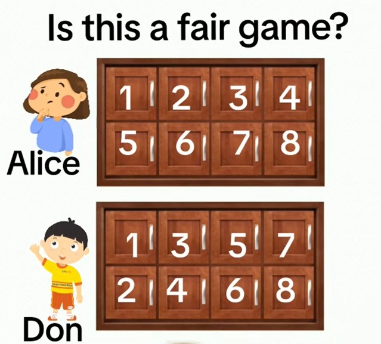

# Fair Game Analysis

This repository contains a Jupyter Notebook (`fair_game.ipynb`) that explores a hypothetical game scenario where Alice and Don compete to be the first to find a star.

# Fair Game?
* There are gold stars hidden behind two doors of each cabinet
* Any pair of doors are equally likely
* The stars in the second cabinet will always be hidden behind the same doors as the stars in the first cabinet
* Alice and Don open the door in the order shown below
* They each open one door per second
* The first person to find **ONE** of the stars wins
* Alice and Don play this game over and over with the stars moving every round (rounds are independent)
* Rounds **CAN** end in a tie

Are Alice and Don equally likely to win or does on of them have an edge?



## Features

- Simulates different combinations of outcomes in a fair game.
- Tracks and counts wins for Alice, Don, and ties.
- Determines the likelihood of each player winning based on results.
- Utilizes Python libraries for calculations and analysis.

## File Structure

- `fair_game.ipynb`: The primary Jupyter Notebook containing all code, simulations, and analysis.
- `README.md`: This documentation file.

## Installation

To run the notebook, you will need Python 3.x and the following libraries installed:

- `itertools` (built-in)
- `jupyter`

You can install Jupyter using pip if it's not already installed:

```bash
pip install notebook
```

## Usage

1. Clone this repository:

```bash
git clone https://github.com/barrychocolate/fair_game.git
```

2. Navigate to the project folder:

```bash
cd fair-game-analysis
```

3. Open the notebook in Jupyter:

```bash
jupyter notebook fair_game.ipynb
```

4. Run all cells to simulate the game and analyze the results.

## Example Output

The notebook provides:
- A breakdown of all possible outcomes.
- Counts of wins for Alice, Don, and ties.
- The player most likely to win based on the generated results.

Example output:

```
Number of wins for Alice: 10
Number of wins for Don: 8
Number of Tie games: 2
Alice is more likely to win.
```

## Contributing

Contributions are welcome! Please submit a pull request or open an issue for any suggestions or improvements.

